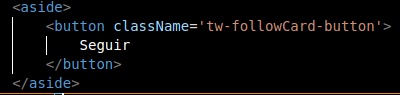
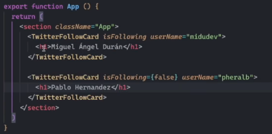
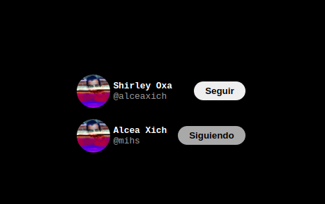

# Curso de REACT
## Introducción
Bienvenido al repositorio **React**. Aquí encontrarás el código fuente y la documentación asociada a la  libreria según los recurso utilizados. Siéntete libre de explorar, contribuir y mejorar. ¡Gracias por tu interés en nuestro proyecto!".
¡A seguir aprendiendo! :D

**Nota**: Si bien no se encontrara toda la informacion de REACT, solo lo que considere importante recordar y recalcar.
## Objetivo
-   Aprender React
-   Comprender los conceptos de react. 
## Recursos
- [Curso de React [2023]: De cero hasta crear tus primeros componentes con estado](https://www.youtube.com/watch?v=7iobxzd_2wY&list=PLUofhDIg_38q4D0xNWp7FEHOTcZhjWJ29)
- [Wiki react](https://www.reactjs.wiki/)

## Definiciones importantes
- **Vanilla js**: es el nombre con un poco de humor que le ha dado la comunidad al javascript puro o más bien, a la ausencia de librerías y frameworks de Javascript y de ahí el concepto del “renacer”.
- **jsx**: Se llama JSX, y es una extensión de la sintaxis de JavaScript. Se recomienda usarlo con React para describir cómo debería ser la interfaz de usuario. JSX puede recordarte a un lenguaje de plantillas, pero viene con todo el poder de JavaScript.
- **Hooks**: añadir funcionalidad a los componentes de react.
  - **useState**: sirve para guardar una variable. 

## Apuntes importantes
- Para trabajar con jsx, podemos usar los siguientes empaquetadores:
  - Create React App
  - Vite
- Nomenclaturas de programacion: es el tipo de escritura.
  - **PascalCase** -> los combres de los componentes deben usar esta nomenclatura.
  - camelCase
  - snake_case
  - kebab-case
- Para agregar estilos a react existen 2 formas:
  1. En linea: `style={{display:'flex',color:'green'}}` **¡No es la forma correcta!**, en reac native se usa.
  2. Llamar a un archivo externo.
- Para evaluar una expresion se usan las llaves `{}`.
- `<React.Fragment>...</React.Fragment>` se puede usar de la siguiente manera -> `<>...</>`.
- Las props deben ser inmutables.
- childres -> vendria a  ser todo lo que se envuelve en el caso de la siguiente imagen **seguir** es considerado como children.

- Un chidren puede ser una cadena de texto, o un componente o un elemento de html.

## Proyectos
### 00-hola-mundo
En este proyecto se aprendio la creación de comoponentes, props, children, hooks.
Como resultado se tuvo lo siguiente:
